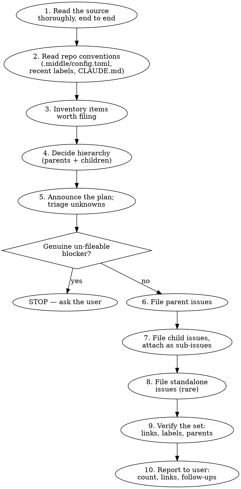

# Creating GitHub Issues

End-to-end workflow for taking a planning artifact (spec, brainstorm, build doc) and producing a set of well-formed GitHub issues with consistent titles, complete acceptance criteria, proper labels, and correct parent/sub-issue hierarchy. The output is the seed set of work that downstream skills (`implementing-github-issues`, `recommending-github-issues`) operate on.

## Core principles

**Issues are inputs to other skills, not implementation plans.** An issue captures *what* and *why*; the implementer's plan (in their PR's `planning/issues/<num>/plan.md`) captures *how*. Don't pre-decide implementation in the issue body; the implementer needs room to research and adapt.

**A well-defined spec lands well-defined issues — without a confirmation gate.** When the source is clear, file directly. Don't stall the user with an "OK to proceed?" gate on work they already specified. The discipline is in *reading the source completely* and *resolving ambiguity correctly*, not in asking permission. (See Phase 5 for how unknowns are handled — most are resolved by a judgment call or by filing the unknown *as* a decision issue; only a genuine, un-fileable blocker stops the run.)

**Acceptance criteria are mandatory.** The recommender classifies issues without acceptance criteria as `needs-human`. An issue filed without explicit criteria lands in human-review purgatory until someone fixes it. Always include them, even when obvious.

**The title is the most-read line.** It shows up in issue lists, PR cross-references, the state issue's Ready-to-dispatch table, and notifications. Verb-led, scoped, ≤72 chars. The title locates; the body explains. Titles must be self-sufficient enough that a phase-estimating recommender can rank them without re-reading the source.

**Hierarchy by default, standalone by exception.** If you're filing more than one issue from the same source, they almost always have a natural parent. Create the parent first, file children as sub-issues. Standalone issues are reserved for genuinely cross-workstream work.

**Labels are the system's vocabulary.** Stick to the controlled set declared in `.middle/config.toml` (or the project's labels convention). Inventing new labels mid-batch fragments the dashboard and confuses the recommender.

**Every issue is informed by *something* — find it, don't pad it.** Almost no issue exists in a vacuum: there is a spec section, a prior issue, existing code, a design doc, or a skill the implementer should use. The References section's job is to surface that. But a reference that doesn't add value is worse than no line at all — never write filler like "Suggested skills: none". Include the line when it helps; omit the line when it doesn't. The section header always stays (parsing ease).

**File in two passes: content first, cross-references second.** Pass 1 (Phases 6–8) files every issue with its self-contained content. It does NOT write forward-references — you can't cite issue numbers that don't exist yet. Pass 2 (Phase 9) walks the filed set and wires real `#N` cross-references. Writing `#PENDING` or "the sibling sub-issue" placeholders in pass 1 is the failure this two-pass rule prevents.

## When to use

- User provides a multi-section spec, build doc, or brainstorm output and says "create issues for this"
- User asks to "seed", "file", "break down", or "expand" a planning doc into trackable work
- User has a list of TODOs / acceptance items and wants them on GitHub
- User wants to bootstrap a new project's issue tracker from a design document

**Don't use for:**
- Filing a single ad-hoc issue while implementing something else (just `gh issue create`)
- Filing follow-ups discovered mid-implementation — that belongs in `implementing-github-issues` Phase 9
- "Re-organizing" an existing issue tracker (re-labeling, splitting, merging) — that's project management, not creation
- Filing issues that are actually questions or discussions (use a GitHub Discussion or comment on an existing issue)

## Workflow



## Phase 1 — Read the source thoroughly

Before filing anything, read the entire planning artifact end to end. If it's a multi-document spec, read all of it.

Note as you read:
- Explicit acceptance criteria (lists, "must do X", checkboxes)
- Implicit acceptance criteria (dependencies between sections, ordering constraints)
- Items that are clearly scoped vs. items that need clarification
- Items that are *not* work-to-be-done (background, glossary, non-goals)
- Cross-references between sections (these often become parent/child relationships)
- If the source provides its own breakdown (phases, milestones, numbered tasks), **that breakdown is your hierarchy** — use it as given rather than re-deriving one.

## Phase 2 — Read repo conventions

Run, in order:

```bash
gh repo view <repo> --json defaultBranchRef,labels
gh label list --limit 200
gh issue list --state all --limit 30 --json number,title,labels
```

Note:
- **Existing labels** — the controlled vocabulary. Use these; don't invent.
- **Recent issue titles** — the project's naming convention (verb-led? scope-prefixed? conventional-commit style?). Match it.
- **Label families** — `phase:N`, `area:X`, `priority:N` style. Conform.

If `.middle/config.toml` exists in the repo, read it for the controlled vocabulary middle expects:
- `agent:claude-code`, `agent:codex` — adapter overrides
- `approved` — bypasses the complexity ceiling
- `agent-queue:state`, `agent-queue:eligible` — middle internals (don't apply to new issues)
- `needs-design`, `blocked`, `wontfix` — recommender exclusion signals (use deliberately)

If a label the plan requires doesn't exist yet, create it (`gh label create <name> --color <hex> --description "<purpose>"`) — label creation is reversible and on the build path. Inventing a label *not* called for by the plan or the user is the thing to avoid.

## Phase 3 — Inventory items worth filing

Walk the source and produce a flat list of *candidate* items. Don't refine yet — just capture.

Each candidate:
- One concrete deliverable
- Scoped to something an agent or human could reasonably work on in one PR
- Not duplicative of another candidate

**Pruning rules:**
- Background prose, glossaries, non-goals → NOT issues
- Decisions already made (in the spec) → NOT issues (they're context, not work)
- A single big "implement Phase 4" item that's really five sub-items → split into the five sub-items
- An item that's actually two unrelated concerns → split

**Sizing rules:**
- Target: each issue is ~1-4 phases of work (matches middle's typical complexity ceiling)
- If an item is clearly 6+ phases, either split it OR mark it for the `approved` label note (the recommender will exclude it from auto-dispatch otherwise)
- If an item is <1 phase ("rename a variable"), consider whether it deserves an issue at all vs. being absorbed into a related one

## Phase 4 — Decide hierarchy

Walk the inventory and group. For each group:

```
Is there a natural umbrella concept that ties these together?
  YES → that umbrella is the parent issue; the items are children
  NO → these are siblings or standalone
```

Default to parent/child. Standalone is rare. The state issue's `Blocked` section and the dashboard's grouping both work better when issues live under parents.

Write the tree to a scratch file (`/tmp/issue-plan-<timestamp>.md`) before filing — it's both your filing checklist and the artifact you announce in Phase 5:

```
PARENT: Implement state-issue parser and renderer  [phase:0, bootstrap]
  ├── Define state-issue.v1 TypeScript types
  ├── Implement parseStateIssue
  ├── Implement renderStateIssue
  ├── Add round-trip fuzz tests
  └── Wire validation against schema doc

PARENT: Build minimal dispatcher  [phase:1, bootstrap]
  ├── SQLite migrations + db wrapper
  ├── Config loader (TOML)
  ├── AgentAdapter interface
  ├── ClaudeCodeAdapter (spawn + classify, no hooks yet)
  ├── tmux helpers
  ├── Worktree helpers
  └── First implementation workflow (3 steps)

STANDALONE: Add MIT LICENSE  [housekeeping]
STANDALONE: Set up CI on push to main  [housekeeping]
```

Parent issues describe the umbrella; their bodies stay short and link to the spec section. Child issues carry the real acceptance criteria.

## Phase 5 — Announce the plan; triage unknowns

**This is not a confirmation gate.** A well-defined spec proceeds straight to filing. State the plan for transparency (so the user can catch a structural error cheaply), then keep going — don't wait for an "OK".

Announce, concisely:

```
Planned for <owner>/<repo>: 4 parents + 23 children + 2 standalone = 29 issues.
  P1. "Implement state-issue parser and renderer" [phase:0, bootstrap] — 5 children
  P2. "Build minimal dispatcher" [phase:1, bootstrap] — 7 children
  ...
  S1. "Add MIT LICENSE" [housekeeping]
Labels applied: phase:0..2, bootstrap, dogfood, housekeeping.
Labels left for the user: agent:claude-code, agent:codex, approved.
Filing now.
```

Then **triage every unknown** you flagged in Phases 1 and 3. For each ambiguity, pick one:

1. **Resolvable by a reasonable judgment call** — make the call, file the issue, note the assumption in the issue body's Context section ("Assumed X; the spec was silent."). Most ambiguities are this.
2. **Itself a unit of work** — the unknown *is* a decision someone needs to make. File it as a decision issue rather than blocking: title it `Decide: <X> vs <Y>` or frame the issue body around the open question with acceptance criteria like "a decision is recorded with rationale". An architectural fork the implementer can A/B in a worktree is this category — file it, don't ask.
3. **Genuine, un-fileable blocker** — the ambiguity makes correct issue creation *impossible* and can't be deferred into an issue (e.g., you can't tell which repo to file against, or two spec sections flatly contradict each other on what's in scope). **Only this category stops the run.** STOP and ask the user one specific question.

The bar for category 3 is high. "I'm not 100% sure how big this is" is category 1. "Should this be one issue or two" is category 1. "The spec mentions both X and Y as the storage layer and they're mutually exclusive" is category 3.

## Phase 6 — File parent issues first

For each parent:

```bash
gh issue create \
  --title "<verb-led, scoped, ≤72 chars>" \
  --label "<comma,separated,labels>" \
  --body "$(cat <<'EOF'
## Context
<1-3 sentences pointing to the spec section this comes from. Link to the spec
location in the repo or to the source doc. Keep it short — the parent's purpose
is to group, not to re-summarize.>

## Scope
This is a parent issue tracking <N> related sub-issues. See the linked sub-issues.

## Acceptance criteria
- [ ] All sub-issues closed
- [ ] <any parent-level acceptance, e.g., "round-trip fuzz test green on 10k iterations">

## References
- Spec: <link or path>
EOF
)"
```

Capture the returned issue number for each parent — you'll need it to attach children. Do NOT add "Related" / "unblocks" lines yet — those are forward-references wired in the Phase 9 second pass.

## Phase 7 — File children, attach as sub-issues

For each child:

```bash
# 1. Create the child
URL=$(gh issue create \
  --title "<verb-led, scoped, ≤72 chars>" \
  --label "<labels>" \
  --body "$(cat <<'EOF'
## Context
<1-3 sentences: what is this, where in the spec it comes from, why it matters.
Link the spec section.>

## Acceptance criteria
- [ ] <concrete, verifiable criterion #1>
- [ ] <concrete, verifiable criterion #2>
- [ ] <...>

## Out of scope
- <things that look related but belong to a sibling or future work — describe
  in prose; do NOT cite sibling #numbers here, that's the Phase 9 second pass>

## References
- Parent: #<parent-num>
- Spec: <path:section or link>
- Supporting material: <only if it adds value — a repo skill the implementer
  should use, a local design doc, a web reference, a code path to study>
EOF
)")
CHILD_NUM=$(basename "$URL")

# 2. Look up the child's database ID (NOT the issue number, NOT the node_id)
CHILD_ID=$(gh api /repos/<owner>/<repo>/issues/$CHILD_NUM --jq '.id')

# 3. Attach as sub-issue under parent
# CRITICAL: -F (integer) not -f (string)
gh api --method POST /repos/<owner>/<repo>/issues/<parent-num>/sub_issues \
  -F sub_issue_id=$CHILD_ID
```

**Critical mechanical details (don't get these wrong):**
- The sub-issues endpoint requires the *database ID* of the child, not the issue number or node_id. The lookup is `gh api /repos/.../issues/<num> --jq '.id'`.
- Use `-F` (integer) not `-f` (string). The endpoint rejects strings with `Invalid property /sub_issue_id: "12345" is not of type integer`.
- Sub-issue linking is one-directional in the API call (parent ← attach child), but renders bidirectionally on GitHub.

**Pass 1 writes no forward-references.** As you file each child, its body cites only things that already exist: the Parent (`#<parent-num>`, just created) and the Spec. It does NOT cite sibling issues, blocked-by issues, or later-phase issues — those numbers don't exist yet, and `#PENDING` / "the sibling sub-issue" placeholders are not acceptable substitutes. Hold all `#N` cross-references for the Phase 9 second pass.

## Phase 8 — File standalone issues

Same body template, but skip the sub-issue attachment step. Standalone bodies must explicitly justify why they're standalone:

```markdown
## Why standalone
<e.g., "Cross-cuts all phases — sets up CI infrastructure independent of
feature work" or "Housekeeping, not on the build path">
```

## Phase 9 — Verify the set, then second-pass the cross-references

### 9a. Verify

```bash
# Count what was created — should match the Phase 4 plan
gh issue list --state open --search "created:>$(date -u -v-1H +%Y-%m-%dT%H:%M:%SZ) author:@me" --limit 200

# Verify each parent shows its children
for parent in <list of parent numbers>; do
  echo "Parent #$parent:"
  gh api /repos/<owner>/<repo>/issues/$parent/sub_issues --jq '.[].number'
done

# Verify labels applied correctly
gh issue list --state open --search "created:>$(date ...) author:@me" \
  --json number,title,labels --jq '.[] | {n: .number, t: .title, l: [.labels[].name]}'
```

If any sub-issue attachment failed (rate limit, transient API error), retry it. If a label is missing, add it with `gh issue edit <num> --add-label <label>`.

### 9b. Second pass — wire cross-references

Now that every issue exists and has a real number, walk the filed set and add the `#N` cross-references that pass 1 deliberately omitted. Build a title→number map from the verify output, then for each issue that has a genuine relationship, append a `Related:` line (or `unblocks:` / `blocked by:`) to its `## References` section:

```bash
# Per issue needing cross-refs: fetch body, append Related line, edit.
gh issue view <num> --json body --jq '.body' > /tmp/body-<num>.md
printf '\n- Related: #%s (%s)\n' "<other-num>" "<relationship>" >> /tmp/body-<num>.md
gh issue edit <num> --body-file /tmp/body-<num>.md
```

Only add a cross-reference that carries information — a real dependency, a sibling that must land first, a parent this unblocks. Don't cross-link issues just because they're in the same phase. The hierarchy already expresses that.

## Phase 10 — Report to user

Final summary:

```markdown
Filed 29 issues on <owner>/<repo>:

**Phase 0 — Bootstrap state-issue parser**
- #142 (parent) Implement state-issue parser and renderer
  - #143 Define state-issue.v1 TypeScript types
  - #144 Implement parseStateIssue
  - #145 Implement renderStateIssue
  - #146 Add round-trip fuzz tests
  - #147 Wire validation against schema doc

**Phase 1 — Minimal dispatcher**
- #148 (parent) Build minimal dispatcher
  - ...

**Standalone**
- #170 Add MIT LICENSE
- #171 Set up CI on push to main

**Judgment calls made** (spec was silent; assumptions noted in issue bodies):
- #15X — assumed <X>
**Decision issues filed** (unknowns turned into work):
- #16X — "Decide: <X> vs <Y>"
**Follow-ups for you:**
- Apply `agent:claude-code` to issues you want pinned to an adapter
- Apply `approved` to any issue you expect to exceed the complexity ceiling
```

Call out every judgment call and every decision issue explicitly — the user reviews these first.

## Body template — required sections

Every child or standalone issue MUST have all four section *headers*, in order. The headers are fixed (parsing ease); the *content* of each is filled only where it adds value.

```markdown
## Context
<1-3 sentences. What is this, where it comes from, why it matters.>

## Acceptance criteria
- [ ] <concrete, verifiable criterion>
- [ ] <...>

## Out of scope
- <items that look related but aren't part of this issue>
- <if genuinely nothing, write "- Nothing beyond the criteria above." — don't omit the header>

## References
- Parent: #<num>                  (sub-issues only)
- Spec: <path:section or link>
- Supporting material: <a repo skill the implementer should use, a local design
  doc, a web reference, a code path to study — whatever genuinely informs the work>
- Related: #<num>                 (added in the Phase 9 second pass — omit in pass 1)
```

**References rules:**
- The `## References` header is always present.
- Include a line only when it adds real value. Omit lines that don't — never write filler ("Suggested skills: none", "Related: n/a"). An omitted line is correct; a filler line is noise.
- But *look before you omit*. Almost every issue is informed by something — a spec section, prior art in the codebase, a doc, a skill. "No references" usually means you didn't look hard enough. Spec is nearly always citable; a skill usually is.
- `Related:` lines are forward-references — leave them out in pass 1, add them in the Phase 9 second pass.

Parent issues use a simpler template (same References rules apply):

```markdown
## Context
<1-3 sentences linking to the spec section>

## Scope
This is a parent issue tracking <N> related sub-issues.

## Acceptance criteria
- [ ] All sub-issues closed
- [ ] <parent-level acceptance if any>

## References
- Spec: <path:section or link>
```

## Acceptance criteria — what counts

Good acceptance criteria are:
- **Concrete** — names a file, function, behavior, or output
- **Verifiable** — passes/fails on inspection or a test
- **Scoped** — applies only to this issue, not to siblings

Examples of good criteria:
- `parseStateIssue('valid body') returns a ParsedState with all 7 sections populated`
- `Round-trip render(parse(body)) is byte-identical for 10,000 fuzzed inputs`
- `mm init <path> creates a state issue and writes its number to .middle/config.toml`

Examples of bad criteria (rewrite these before filing):
- "Parser works correctly" — what does correct mean?
- "Good test coverage" — what's the threshold?
- "Code is clean" — not verifiable
- "Implements the spec" — vague; spell out which sections

If you genuinely can't write concrete criteria for an item, that's a Phase 5 unknown — resolve it by a judgment call (and note the assumption) or file it as a decision issue. Don't file an issue with hand-wavy criteria.

## Labels — apply, don't invent

Apply labels the plan and the repo's vocabulary call for. Create a label the plan requires but the repo lacks (`gh label create ...`) — that's on the build path. Do NOT invent labels the plan and user never asked for.

Middle's controlled labels (applied by this skill when the plan calls for them):
- `phase:N` — phase grouping for build specs
- `bootstrap` — pre-dogfooding work
- `dogfood` — work that flows through middle once dogfooding starts
- `housekeeping` — infrastructure / repo hygiene

Middle's controlled labels (applied manually by the user, NOT by this skill — they're dispatch decisions, not metadata about the work):
- `agent:claude-code`, `agent:codex` — adapter override
- `approved` — bypasses complexity ceiling
- `agent-queue:state`, `agent-queue:eligible` — middle internals
- `needs-design`, `blocked`, `wontfix` — exclusion signals

## Red flags — STOP and self-correct

| Thought | Reality |
|---|---|
| "I'll start filing and figure out the hierarchy as I go" | Sketch the tree first (Phase 4). Filing-then-restructuring leaves orphan issues and broken sub-issue links. |
| "The acceptance criteria are obvious, I'll skip them" | Without acceptance criteria, the recommender excludes the issue. Always include them. |
| "I'll skip the Out of scope / References section, this issue is tiny" | All four section *headers* are mandatory. Small tasks have scope creep; almost every issue is informed by a spec section, a doc, or code. |
| "No skill or doc applies here, I'll write 'Suggested skills: none'" | Filler is noise. Omit the line — but look first: Spec is nearly always citable, and "nothing informs this" usually means you didn't look. |
| "I'll cite the sibling issue I'm about to file" | You can't reference a number that doesn't exist. Pass 1 writes no forward-references; the Phase 9 second pass wires real `#N`. No `#PENDING` placeholders. |
| "I'll write `task #13` / `step #4` to point at the spec" | `#N` is a GitHub *issue* reference. Spec task/step numbers collide with issue numbers and silently link to the wrong issue — and the recommender validates that every `#N` resolves. Never put `#` before a non-issue number. Use prose ("the config-loader task") or a real `#N` from the second pass. |
| "Let me start implementing the first one to see how it goes" | This skill files issues. It does not implement. Stop. |
| "I'll create labels to organize this better" | Create labels the *plan* requires. Don't invent labels the plan and user never asked for. |
| "I should ask the user to confirm before filing" | No bulk confirmation gate. A well-defined spec proceeds. Announce the plan (Phase 5) and keep going. |
| "This part of the spec is ambiguous — I'll stop and ask" | Triage first (Phase 5). Most ambiguity is a judgment call (note the assumption) or a decision issue (file it). Only an un-fileable blocker stops the run. |
| "The spec is clear but big — I'll ask if they really want all 60" | They handed you the spec. Big ≠ unknown. File it. |
| "This item is borderline — file it just in case" | If you can't write a concrete acceptance criterion, it's a Phase 5 unknown. Resolve or file as a decision issue. |
| "Each tiny task should be its own issue" | Group small adjacencies. <1-phase tasks usually belong absorbed into a larger sibling. |
| "I'll attach all the children to one giant parent" | >10 children under one parent means you've missed intermediate structure. |
| "Standalone is fine for everything" | Default is parent/child. Standalone is the exception, and must justify itself in a `## Why standalone` section. |
| "Let me copy the entire spec section into each issue body" | Link to the spec; don't duplicate it. Bodies are short and focused on this issue's acceptance. |
| "I'll pre-decide the implementation in the body" | The body is *what* and *why*. The implementer skill produces the *how* in their PR. Leave them room. |
| "I'll @-mention people to assign work" | This skill files unassigned issues. The user (or the recommender) decides assignment. |
| "Some of these block others — I'll set blockers as I file" | Pass 1 files content with no `#N` cross-refs. The Phase 9 second pass wires every `Related:` / blocker line once all numbers exist. Filing in dependency order is fragile; a second pass isn't. |
| "I'll use `-f sub_issue_id=...`" | `-f` is string; the endpoint rejects it. Always `-F` (integer) with the child's database ID. |

## Common mistakes

**Filing without reading the source end-to-end.** The hierarchy only emerges from the whole. Filing as you read produces a flat list of disconnected items.

**Treating "the spec is large" as "the spec is unclear."** A clear 60-item spec produces 60 clear issues. Volume is not ambiguity. File it.

**Stopping to ask when a judgment call would do.** The Phase 5 triage exists so you resolve ambiguity instead of bouncing it back. Make the call, note the assumption in Context, move on. Reserve STOP for genuine un-fileable blockers.

**Pre-deciding implementation in the issue body.** If you're writing "the parser should use regex X and recursive descent Y", stop — that's a plan, not an issue.

**Inventing labels mid-batch.** Decide labels in Phase 2, stick to them. Half-labeled batches fragment the dashboard.

**Treating every item as a sub-issue of one mega-parent.** Real hierarchy has 2–10 children per parent. 30 children under one parent means you missed intermediate structure.

**Forgetting the sub-issue endpoint's integer requirement.** `-f sub_issue_id=12345` fails with a confusing error. Always `-F sub_issue_id=$CHILD_ID`.

**Writing forward-references in pass 1.** `#PENDING`, "the sibling sub-issue", "see the parser issue (TBD)" — all of these are pass-1 leakage. If you're tempted to cite an issue that doesn't exist yet, stop and leave it for the Phase 9 second pass.

**Filler in the References section.** "Suggested skills: none specific", "Related: n/a" — these add nothing and train the reader to skip the section. Omit the line. But don't use omission as an escape hatch: if you found nothing to cite, you probably didn't look at the spec hard enough.

**`#` in front of a non-issue number.** Specs number their phases, tasks, and steps. Writing `task #13` to cite the spec produces a live link to issue #13 — almost always the wrong issue, since issue numbers and spec task numbers overlap. The `#` is only ever for real issue references. Write spec callouts as prose ("the config-loader task", "Phase 2") with no `#`.

**Acceptance criteria that restate the title.** Title: "Implement parseStateIssue". Criterion: "parseStateIssue is implemented." Not a criterion. A criterion describes observable behavior or output.

**Titles that only make sense next to the spec.** The recommender ranks from the title alone. "Phase 1, task 3" is useless; "Add SQLite migrations and WAL-mode db wrapper" is rankable.

## Related skills

- `implementing-github-issues` — the downstream consumer. An implementer agent picks up an issue this skill filed and takes it to a verified PR. Issue bodies should give that agent what it needs (clear acceptance criteria, suggested skills) and nothing it doesn't (no pre-baked implementation).
- `recommending-github-issues` — the other downstream consumer. Ranks the filed issues for dispatch. It depends on self-sufficient titles and present acceptance criteria.

## Files this skill creates

None durable. Output is GitHub issues, created via `gh`. A scratch hierarchy sketch may be written to `/tmp/issue-plan-<timestamp>.md` during Phase 4 — it's a working artifact, not a deliverable.

## Files this skill reads

- The source planning document(s), wherever they live (filesystem, URL, in conversation)
- The repo's `.middle/config.toml` if present, for label vocabulary
- The repo's existing labels and recent issues via `gh`
- The repo's `CLAUDE.md` files if relevant to vocabulary or conventions
