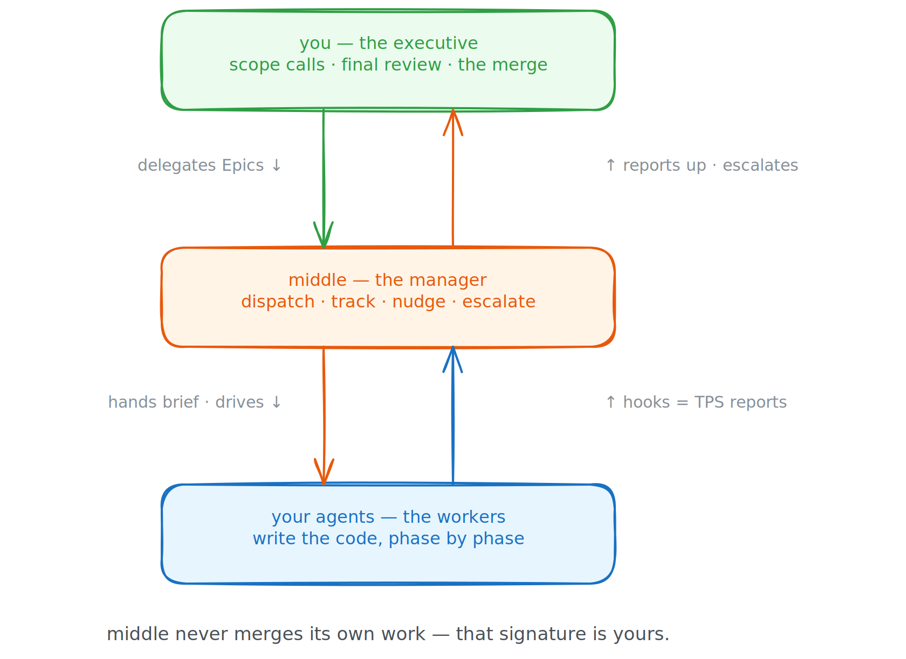
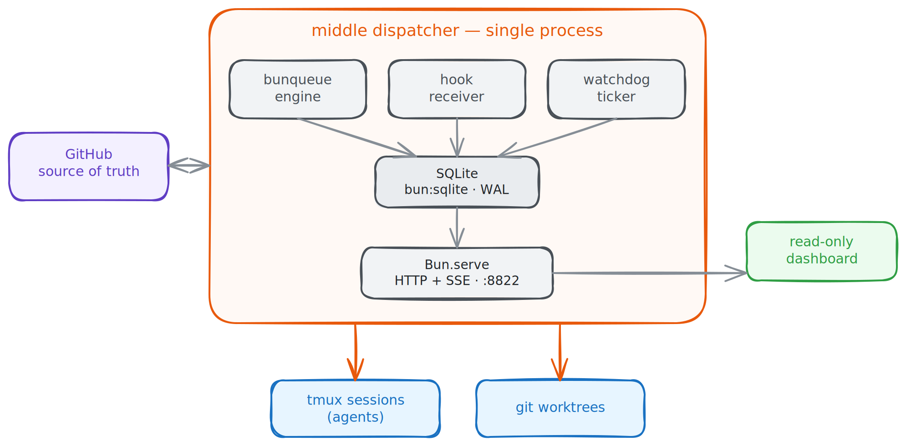

```
 ███╗   ███╗ ██╗ ██████╗  ██████╗  ██╗      ███████╗
 ████╗ ████║ ██║ ██╔══██╗ ██╔══██╗ ██║      ██╔════╝
 ██╔████╔██║ ██║ ██║  ██║ ██║  ██║ ██║      █████╗
 ██║╚██╔╝██║ ██║ ██║  ██║ ██║  ██║ ██║      ██╔══╝
 ██║ ╚═╝ ██║ ██║ ██████╔╝ ██████╔╝ ███████╗ ███████╗
 ╚═╝     ╚═╝ ╚═╝ ╚═════╝  ╚═════╝  ╚══════╝ ╚══════╝
 ───────────────────────────────────────────────────
   m i d d l e   m a n a g e m e n t   f o r   y o u r
              c o d i n g   a g e n t s
 ───────────────────────────────────────────────────
  "Yeahhh... if you could go ahead and ship that Epic,
   that'd be greaaat."                — middle, probably
```

> **MEMO** — TO: your coding agents · FROM: middle (your manager) · RE: the TPS reports
>
> middle is a manager. It does not write code. It assigns the code, watches the code get
> written, collects the status reports, sends people back to fix the review comments, and
> escalates the calls it isn't paid to make. It will *not* sign off on its own work — the
> merge is your signature, boss, not its.

**middle** dispatches coding agents (Claude today, Codex on the roadmap) at GitHub **Epics**. It spins each Epic up in its own worktree and `tmux` session, hands the agent a brief, watches the agent's hooks like a hawk over a cubicle wall, drives the work through every phase, and stops at exactly the moment a decision needs a real human: scope calls beyond its pay grade, and the final review + merge. One Epic → one branch → one PR. The agents do the work; middle does the *managing*; you do the *deciding*.

---

## How the org chart works

<p align="center">
  
</p>

- **One Epic = one branch = one PR.** The Epic's open sub-issues are the workstream's phases. The agent works *down* them on a single branch.
- **The PR opens as a draft** and stays draft until every phase passes its mechanical verification gates. Then the agent marks it ready for review and writes you a reviewer's brief.
- **middle never merges.** Signing off on its own reports is, frankly, above its pay grade. The final review and merge are yours.
- **Stuck ≠ guess.** If the agent hits ambiguous acceptance criteria, or a decision with more candidate forks than the configured complexity ceiling, it parks, writes `.middle/blocked.json`, frees its desk for someone else, and escalates to you on the issue. You reply; it resumes.
- **Code review is a loop.** Changes requested (by a human, or by a review bot like CodeRabbit) → the agent goes back and addresses them, up to 5 rounds before it escalates to you. Approved → it ends the loop and pings you to merge.

---

## Prerequisites (corporate onboarding)

middle shells out to a few tools. `mm doctor` checks all of them for you.

- **[Bun](https://bun.sh) ≥ 1.3.12** — the runtime. middle runs TypeScript directly; there is no build step.
- **tmux ≥ 3.5** — the open-plan office. Agents run as interactive `tmux` sessions; `< 3.5` degrades the keyboard interactivity middle relies on.
- **git** and **[GitHub CLI](https://cli.github.com) (`gh`)** — authenticated (`gh auth login`). middle reads and writes Epics, sub-issues, and PRs through `gh`.
- **[Claude Code](https://claude.com/claude-code) (`claude`)** — the worker. middle launches it; it writes the code.

---

## Install & keep it updated

### One-command install

Clone the repo and run the setup script (or its `package.json` alias):

```bash
git clone https://github.com/thejustinwalsh/middle.git
cd middle
sh scripts/install.sh    # or: bun run setup
```

This installs all workspace dependencies, links `mm` into `~/.bun/bin`, and verifies the
install by printing `mm version`. If `~/.bun/bin` is not on your `PATH`, the script prints
the exact line to add to your shell profile.

### PATH (if mm is not found after install)

Add this to your `~/.bashrc`, `~/.zshrc`, or `~/.profile`:

```sh
export PATH="${PATH}:${HOME}/.bun/bin"
```

Then open a new terminal and run `mm version` to confirm.

### Keeping mm current

Because `bun link` creates a symlink directly into the repo source and Bun runs TypeScript
natively, `git pull` already updates `mm` — no rebuild needed.

To update:

```bash
mm update          # verifies the tree is clean and on main, then pulls + reinstalls
# or manually:
git pull && bun install
```

`mm update` refuses if your checkout is dirty or on a non-`main` branch — it is linked to
your dev checkout and may have local changes. The refusal message includes the manual steps.

To check what version you are running:

```bash
mm version         # prints: mm 0.0.0 (abc1234, main)
```

### Verify the toolchain

```bash
mm doctor             # checks bun / tmux / claude / git / gh + gh auth
mm verify-file-mode   # drives the file-mode dispatch loop end to end (add --live for a real-GitHub smoke)
```

Once `mm doctor` passes, `mm start` runs the dispatcher. To have middle come up on boot and
restart on crash, run it under systemd/launchd — see **[`docs/daemon-as-a-service.md`](docs/daemon-as-a-service.md)**. Beyond `mm doctor`'s toolchain checks, `mm verify-file-mode` proves the dispatch loop itself runs end to end — see [Live-smoke verification](docs/dogfooding.md#live-smoke-verification) for what it covers and the opt-in `--live` real-GitHub smoke.

Configuration is optional — middle ships with working defaults. To override, drop a `~/.middle/config.toml` (defaults shown):

```toml
[global]
dispatcher_port = 4120               # the hook server + dashboard agents report to
max_concurrent  = 4                  # how many agents in the office at once
default_adapter = "claude"
worktree_root   = "~/.middle/worktrees"
db_path         = "~/.middle/db.sqlite3"
log_dir         = "~/.middle/logs"

[adapters.claude]
binary          = "claude"
permission_mode = "auto"
```

---

## Seeding the backlog

middle is a manager, not the idea guy. It dispatches against the work *you* put on the board — well-formed **Epics**: a parent issue per phase, each with sub-issues that carry real acceptance criteria. It does not invent the backlog. Here's how middle's own backlog gets seeded, and how to seed yours:

**1. Plan it.** Turn an idea into a spec and a phased plan. We use the **superpowers** Claude Code plugin's `brainstorming` → `writing-plans` skills (install it once from the plugin marketplace via `/plugin`). Any planning workflow works — the point is a structured plan with discrete phases.

**2. Bootstrap the repo for middle.** `mm init <repo-path>` (a path to a local checkout, same as `mm dispatch`) stamps the `creating-github-issues`, `implementing-github-issues`, and `recommending-github-issues` skills into the repo, installs the hooks, and creates the dispatch **state issue**.

**3. File it as structured issues.** Now that `mm init` has installed `creating-github-issues`, hand the plan to that skill and ask it to file all the work. It creates a parent Epic per phase with sub-issues underneath — each with acceptance criteria, the right labels, and proper parent/child hierarchy, exactly the shape middle's recommender and implementer expect.

**4. Hand off to middle.** `mm dispatch <repo-path> <epic>`, and the manager takes it from there.

In short: **you** (or a planning agent) decide *what* and file it as Epics; **middle** manages *getting it built*. middle never invents headcount or greenlights projects — that, too, is above its pay grade.

---

## Running the office

```bash
mm start                    # open the office: dispatcher = hook server + workflow engine
mm dispatch <repo> <epic>   # "I'm gonna need you to go ahead and take this Epic, mmkay"
mm status                   # the standup: who's working, who's blocked, who's parked
mm doctor                   # the system check (did you get the memo?)
mm stop                     # everybody go home
```

`mm dispatch <repo> <epic>` takes the path to a local repo checkout and an Epic (or standalone issue) number. For local development you can also run the dispatcher in the foreground with `scripts/dev.sh`.

**What a dispatch actually does:** middle creates a fresh worktree (a clean cubicle), launches the agent in `tmux`, hands it the dispatch brief (`.middle/prompt.md`), and listens to its hooks — the turn-by-turn TPS reports — while a watchdog keeps an eye out for anyone asleep at their desk. The agent works the Epic's sub-issues phase by phase, closing each one as it lands, pushes commits to the draft PR, and when every phase passes the mechanical gates it flips the PR to ready-for-review and posts a reviewer's brief on both the Epic and the PR. Then it stops and waits for you.

<p align="center">
  
</p>

---

## What's under the hood

One Bun process. No build step. The dispatcher is `bunqueue` + a hook receiver + a watchdog ticker, all writing to a local SQLite (WAL) and serving a read-only dashboard over HTTP+SSE. GitHub is the source of truth for the work; the dispatcher spawns `tmux` sessions for the agents and `git` worktrees to isolate them.

<p align="center">
  
</p>

---

## We eat our own dog food (yes, really)

This is the part where the manager assigns themselves a performance review.

From Phase 3 of its own build plan onward, **every feature of middle is filed as a GitHub Epic on this very repo and shipped *by middle itself*.** The bot you just set up is, somewhere right now, building the next version of the bot you just set up. There is a half-finished Epic on the board with middle's name in the dispatch log as we speak — a middle-dispatched agent wrote the code while a human (hi) reviewed the PR and pressed merge.

If you want to see it: browse the open [Epics](https://github.com/thejustinwalsh/middle/issues?q=is%3Aissue+label%3Aepic) — the ones labeled `dogfood` are the workstreams flowing through middle. The `planning/middle-management-build-spec.md` is the authoritative blueprint the whole thing is being built from, one self-assigned Epic at a time.

---

## Going deeper

- **[`docs/operator.md`](docs/operator.md)** — the operator how-to: every `mm` command, the daily run loop, `mm doctor`, backups, and resetting state.
- **[`docs/daemon-as-a-service.md`](docs/daemon-as-a-service.md)** — run middle under systemd/launchd so it survives a reboot and restarts on crash.
- **[`docs/vocabulary.md`](docs/vocabulary.md)** — every GitHub label middle reads, what it means, and what middle does in response.
- **[`docs/architecture.md`](docs/architecture.md)** — how the pieces fit: the daemon, the dispatch lifecycle, the crons, and why SQLite is operational state while GitHub is the system of record.
- **[`docs/adapters.md`](docs/adapters.md)** — the `AgentAdapter` interface every coding-agent CLI implements.
- **[`docs/bootstrap.md`](docs/bootstrap.md)** — what `mm init` stamps into a target repo, and how to remove it.
- **[`docs/skill-enforcement.md`](docs/skill-enforcement.md)** — the gates that hold a dispatched agent to the workflow.
- **[`docs/dogfooding.md`](docs/dogfooding.md)** — how middle builds itself.
- **`planning/middle-management-build-spec.md`** — the authoritative design: architecture, the adapter interface, the dispatch lifecycle, the state-issue schema, and the full build sequence (phases 0–11).
- **`CLAUDE.md`** — the working conventions every contributor and every dispatched agent follows (Conventional Commits, the Epic/PR workflow, the byte-identical state-issue round-trip invariant).

Now, if you could go ahead and come in on the merges, that'd be greaaat.
