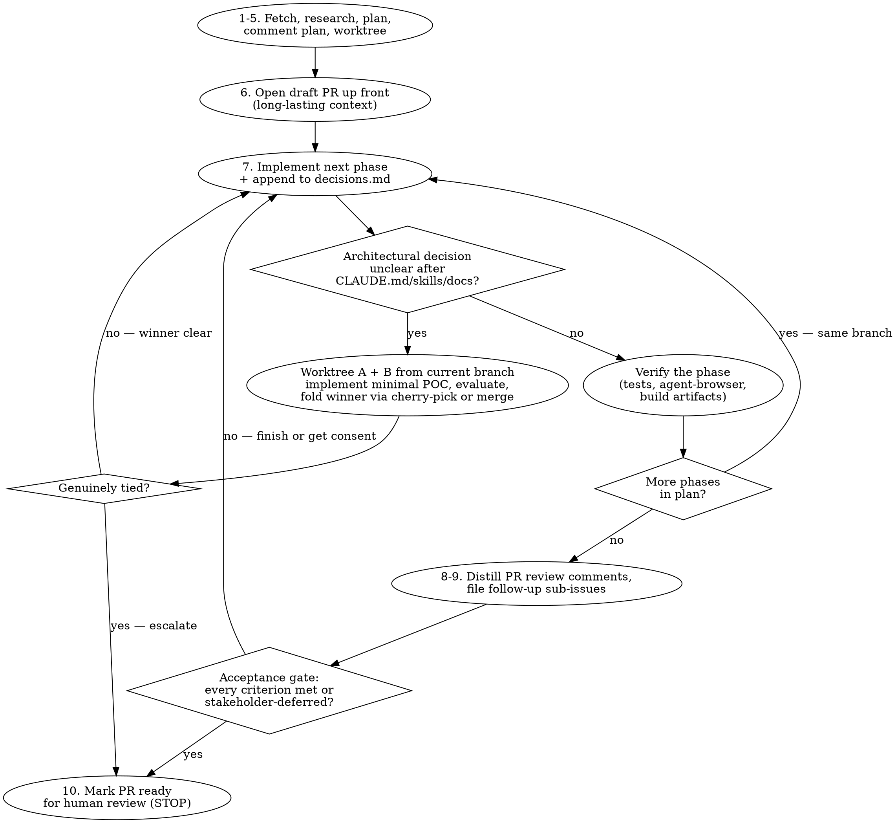
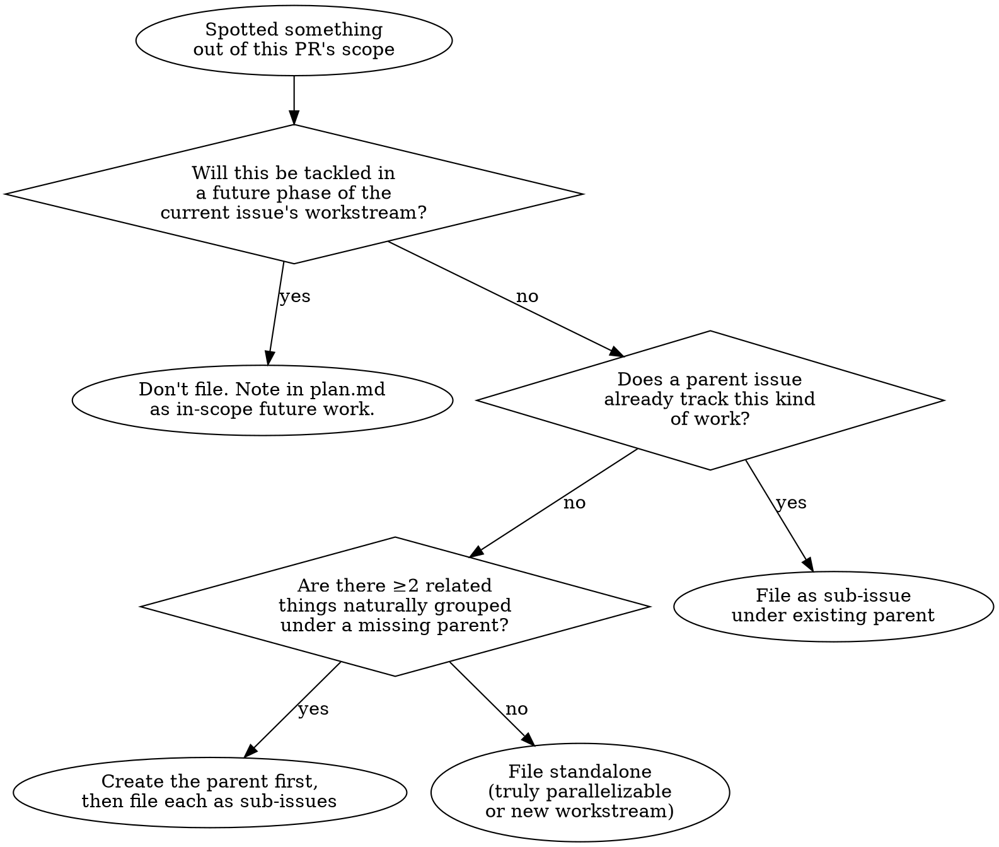

# Implementing GitHub Issues

End-to-end workflow for taking an Epic from "assigned" to "PR open with verification evidence, marked ready for human review." All phases of one Epic land on **one branch** and **one PR**; the PR is the long-lasting context for the workstream.

**Mode-specific commands:** the Epic's data and the agent-↔-human conversation live in one of two stores — a GitHub issue (**GitHub mode**) or a Markdown file under `planning/epics/` (**file mode**). PRs, reviews, and CI are GitHub-native in *both* modes. This skill body is mode-agnostic: it says "fetch the Epic", "post the plan to the Epic", "close the sub-issue with evidence", "post the reviewer's brief", "mark the PR ready" — the concrete incantations live in `references/<mode>-mode-commands.md` (`github-mode-commands.md` / `file-mode-commands.md`), mirrored into your worktree at `.middle/skills/implementing-github-issues/references/` for your run's mode. Use that file for every Epic/plan/sub-issue/conversation operation; use the PR commands (identical in both modes) inline below.

## Dispatch brief (read first)

Before anything else, check for `.middle/prompt.md` in the working directory. If it exists, it is **middle's dispatch brief** — read it and honor it. It carries the operating framing for an autonomous run (work continuously, don't stop to ask questions you can resolve yourself, terminal state is PR-ready), plus any per-dispatch operator notes (plan changes, scope adjustments, "skip X"). Operator notes in the brief override the defaults below. If the file is absent, you're being run interactively by a human — proceed normally.

## Core principles

**The code shows WHAT. The PR explains WHY.** Code comments are reserved for non-obvious constraints. Reasoning, alternatives considered, and tradeoffs go in the **decisions log** (`planning/issues/<num>/decisions.md`), then get distilled into PR review comments and the PR description.

**Iteration > theory.** Branches are sandboxes; you don't know the reality of a plan until you commit work to it. Build to learn, don't theorize to plan. Three concrete forms:

- **Verification gaps → build the verification.** Write the test, run the probe, drive the dev server with `agent-browser`. Don't wait for human review to learn whether the work is correct.
- **Phase verified → start the next phase on the same branch.** All phases of one issue land on one branch and one PR; the PR is long-lasting context. Don't gate on merge between phases. Don't open a new PR per phase.
- **Architectural decision unclear after consulting CLAUDE.md / repo skills / project docs → worktree both options.** Implementations resolve ambiguity faster than debate. Only when both built artifacts come back genuinely tied do you stop and elevate for manual review.

**Hard rule: the skill never merges the PR.** The PR is the long-lasting context for the workstream; merging is the human's final gate. The terminal state is "PR open, all phases verified, follow-ups filed, marked ready for review."

**The PR must be cleanly mergeable.** A human (or middle) merges at the very end — a branch that conflicts with `main` stalls at that gate, after all the verification work is done. Keep the branch synced with `main` as you go and resolve any divergence *before* you mark ready; conflict resolution is your job, never a problem you hand to the merger. See **"Keeping the branch mergeable into main"** for the rebase-vs-merge rules.

## When to use

- User pastes an issue number (`#123`), URL (`https://github.com/.../issues/123`), or says "implement #N"
- User asks to "pick up", "work on", "ship", or "close out" an issue
- The work is scoped by an existing GitHub issue (not a fresh feature request — for those, use `superpowers:brainstorming` first)

**Don't use for:**
- Drive-by fixes with no associated issue (just open a PR)
- Issues that are actually discussions/questions (reply on the issue instead)
- Cross-repo or epic-level work spanning multiple issues (split first)

## Workflow



## Verification mindset

When you can't tell whether a phase's work is correct, the first instinct is **"what can I build to verify this?"** — not "let me wait for human review." Tools at your disposal (per project; not all projects have all of these):

| Verification need | Tool |
|---|---|
| Logic correctness | Vitest unit tests |
| User-visible behavior | Playwright functional tests |
| Visual / interactive verification | `agent-browser` skill (if installed) — drive the dev server, take screenshots, click through |
| Live-system invariants only emergent in full play | Vitexec integration tests (see "Integration test gate" below) |
| Build artifacts | Inspect `dist/` for expected files, sizes, content; grep generated CSS/JS |
| API endpoints | curl against dev server; assert response shape |
| Type correctness | `pnpm typecheck` (or whatever the project exposes) |
| Console / network errors | `agent-browser` console reads, network logs |

When verification reveals an actual problem, fix it. When verification proves the work, **document the verification approach in the PR** (commands, screenshots, assertion snippets) so reviewers can re-run.

The trap to avoid: framing "I'm not sure this works" as a reason to bail out of the plan. Most uncertainty resolves with 10 minutes of test-writing or a 30-second `agent-browser` run. The plan is the commitment; verification is how you keep yourself honest.

### Integration test gate

If the project ships a vitexec-based integration suite, **integration tests are evidence-of-completeness alongside unit tests** for any change touching simulation pipelines, full-system invariants, or wall-clock-dependent behavior (timing, animation, physics, agentic AI).

You'll know a project has one when its `package.json` exposes a separate script (commonly `test:integration` or similar) and there's a sibling vitest config (often `vitest.integration.config.ts`). The integration suite is excluded from the default unit-test runner because each test boots a real browser and observes the running app for tens of seconds; running them on every commit isn't viable.

When you finish a phase that touched the simulation pipeline:
1. Run the unit tests (`pnpm test`). All must pass.
2. Run the integration suite (`pnpm test:integration` or equivalent). All must pass.
3. If the change introduces a new invariant that only emerges in full play, ADD a probe + harness for it in the same commit as the fix. The test IS the verification evidence.

If the project DOESN'T have a vitexec suite and you keep building one-off probes during debugging, that's a signal to invest in scaffolding the suite as part of the workstream rather than re-discovering the pattern in `/tmp` every session.

**See [references/vitexec-integration-suite.md](references/vitexec-integration-suite.md)** for: the live-debugging inner loop with vitexec, the fold-back checklist (one-off probe → committed regression test), the suite layout convention, the probe/harness/runner contracts, the `--gpu` requirement, the game-side-counters technique, and the suite-from-scratch bootstrap guide.

## Architectural forks (only when decisions are genuinely unclear)

You don't fork for every architectural decision. Forks are expensive (two implementations, evaluation overhead). Reserve them for decisions where:

1. The decision affects the implementation in load-bearing ways (not "which CSS class name")
2. CLAUDE.md / repo skills / project docs don't pick a winner
3. Project rules + patterns + fitness tests + perf considerations don't pick a winner

If those criteria are all true, the decision is worth resolving via implementation rather than debate.

### Fork mechanics

```bash
# 1. Worktree both options off the current branch
git worktree add .claude/worktrees/<branch>-fork-A -b <branch>-fork-A
git worktree add .claude/worktrees/<branch>-fork-B -b <branch>-fork-B

# 2. Implement a minimal proof-of-concept on each
#    Each should be small enough to evaluate in 1-2 hours, not days.

# 3. Open both as draft PRs targeting main, link from the core PR description:
#    > **Architectural fork in progress:** evaluating A (#PR-A) vs B (#PR-B).
#    > Decision criteria: <list rules/patterns/fitness signals being checked>.

# 4. Evaluate against project rules + patterns + fitness tests + perf.
#    The CLAUDE.md / repo skills / docs you already consulted are the criteria.
#    Run real tests on each branch; measure bundle size, perf, code clarity.

# 5. Winner clear:
#    - Cherry-pick the winning commits onto the core branch (preferred — works
#      even if the core branch advanced during evaluation)
#    - Or `git merge` the winning branch if the core branch hasn't moved
#    - Close both fork PRs (winner: work is in core; loser: discarded)
#    - Delete both fork branches and worktrees

# 6. Genuinely tied → STOP. Append the comparison to the core PR's description
#    (keep it draft) and elevate for manual review with the fork PR links and
#    the evaluation matrix.
```

**Default assumption during a fork:** you don't iterate on the core branch until the decision resolves. That keeps the fold-back clean (a `git merge --ff-only` works). If you can't sit still and want to continue unrelated work on the core branch, switch to cherry-pick — it copes with a moved core.

**Once chosen, collapse and clean up.** Don't leave the losing branch hanging "just in case." Delete the worktree, delete the branch, close the PR. Forks are disambiguation, not insurance.

## Phase 1 — Fetch the Epic's context

Fetch the Epic — its title, body, acceptance criteria, sub-issues, and conversation log (see `references/<mode>-mode-commands.md` for the exact read).

Read the body AND every conversation entry. The latest decisions are often in the conversation, not the description. Note:
- Acceptance criteria (explicit or implicit)
- Linked issues / PRs / discussions
- Constraints called out by the reporter
- Anyone called out who might be a stakeholder

## Phase 2 — Research the codebase

Before drafting a plan, ground yourself:
- Grep for any symbols/files the issue names
- Read the surrounding code, not just the named file
- Check `git log` on relevant files for recent context
- Read the relevant `CLAUDE.md` (root + nested) — these are the source of architectural patterns and conventions
- For broad investigations, dispatch `Explore` subagent (50-100x context savings)

**STOP if:** The Epic is ambiguous, the acceptance criteria are unclear, or the research reveals the Epic's premise is wrong. Post your questions to the Epic's conversation and wait, rather than guessing. (Headless under middle, "ask a question" is a sentinel-write — see "Running under middle".)

## Phase 3 — Draft a lightweight plan

Write to `planning/issues/<num>/plan.md`:

```markdown
# Issue #<num>: <title>

**Link:** <issue url>
**Branch:** <branch-name>

## Goal
<1-2 sentences — what shipping looks like>

## Approach
<3-6 bullets — the strategy, not a step-by-step>

## Phases
1. <name> — <one-line scope>
2. <name> — <one-line scope>
N. ...

## Files likely to change
- `path/to/file.ts` — <what changes>
- ...

## Out of scope
- <things that look related but aren't part of this issue>

## Open questions
- <anything you'd ask the reporter if they were available>
```

**Lightweight means lightweight.** If you're writing more than ~100 lines for a multi-phase plan, you're either over-planning or the issue should be split. For genuinely complex multi-day work, use `superpowers:writing-plans` and link from the issue comment.

## Phase 4 — Post the plan to the Epic

Post the plan body to the Epic's conversation (the Epic's **plan comment**). See `references/<mode>-mode-commands.md` for the exact write — in GitHub mode it's an issue comment; in file mode the renderer appends it to the Epic file's conversation section (never hand-edit the strict markers).

This is non-negotiable. The plan-on-the-Epic serves three purposes:
1. The reporter / stakeholders can correct your direction before you write code
2. It's discoverable from the Epic itself (not buried in a branch)
3. It creates a public commitment that disciplines the work

If you skip this step, you've broken the contract of this skill.

## Phase 5 — Create worktree branch

**REQUIRED SUB-SKILL:** Use `superpowers:using-git-worktrees` for branch isolation.

Branch naming: derive from issue title, kebab-case, prefixed with issue number if convention dictates. Check recent branches with `git branch -a | head` for the local convention.

This branch is the spine of the workstream. All phases land on it. Only architectural forks branch off it (and fold back into it).

## Phase 6 — Open the PR up front (as a draft)

The PR is opened *before* implementation, not after. It's the long-lasting context for the entire workstream — phases push commits to it; reviewers can subscribe; cross-references from sub-issues and architectural forks have a stable target.

```bash
gh pr create --draft \
  --title "<conventional commit title>" \
  --body "$(cat <<'EOF'
## Summary
Closes #<num>

🚧 **Draft — work in progress.** See plan.md for the full multi-phase scope.

## Plan
<copy from plan.md, or link to the issue comment with the plan>

## Status
- [ ] Phase 1: <name>
- [ ] Phase 2: <name>
- [ ] Phase N: <name>

## Verification evidence
<populated as each phase verifies>

## Decisions
See `planning/issues/<num>/decisions.md` (will be distilled into per-line review comments before final review).
EOF
)"
```

The PR title follows Conventional Commits (per project CLAUDE.md): `feat(scope): ...`, `fix(scope): ...`, etc.

## Phase 7 — Implement the next phase (loop)

For each phase in the plan, repeat:

### 7a. Implement
Atomic commits per logical change. **We rebase, we don't squash.** Keep history clean and meaningful — per-change commits are part of the project's archival record.

### 7b. Append to decisions log
Every time you face a decision worth more than two lines of explanation, append to `planning/issues/<num>/decisions.md`:

```markdown
## <Short decision title>
**File(s):** `path/to/file.ts:123`
**Date:** YYYY-MM-DD

**Decision:** <what you chose>
**Why:** <reasoning, tradeoffs, alternatives considered>
**Evidence:** <link to docs, prior art in codebase, benchmark, etc.>
```

### 7c. Architectural fork? Only when genuinely unclear.
Consult CLAUDE.md / repo skills / project docs first. If they decide it, just decide it. Otherwise see the **Architectural forks** section above.

### 7d. Verify the phase
Per the **Verification mindset** section above. Tests, `agent-browser`, build-artifact inspection, dev-server probes — whatever fits the work. Capture verification evidence in commit messages and/or in `decisions.md`.

**Definition of done — a feature phase is not done until an integration test runs the real path.** Green unit tests are *not* the artifact (Epic #143). A feature phase isn't done until the feature is *wired into the running product* (mounted/served/invoked/reachable — not merely exported) **and** an integration/smoke/e2e test exercises that real path (boots the daemon and hits it; drives the real CLI; GETs the live endpoint). This is the same integration rubric `verifying-requirements` and `mm audit-issues` apply to the issue, now applied to the work: the test that proves the wiring IS the verification evidence. If integration is genuinely infeasible for a phase, declare it explicitly with a human-authored `(integration-exempt: <comment-url>)` annotation on the criterion — never silently ship unit-only. The PR-ready gate enforces this: a feature whose integration criterion isn't evidenced by a named test (and isn't exempted) is **blocked from ready** (see Phase 10a), and the repo's `verify.toml` can declare an `integration`-category gate distinct from its unit gates.

**Integration test gate** (when the project has a vitexec suite — see "Integration test gate" subsection above): if the phase touched the simulation pipeline, full-system invariants, or wall-clock-dependent behavior, run the integration suite and require green BEFORE moving to 7e. New invariants that only emerge in full play should ship with a new probe + harness in the same commit — the test IS the verification evidence. A green unit suite + missing integration coverage is not enough for items in this category.

### 7e. Update the PR description
Tick the phase checkbox in the Status section. Add verification evidence under that phase. Push.

### 7f. Continue to the next phase on the same branch.
Don't open a new PR. Don't wait for human review between phases. The PR is long-lasting context; phases accumulate on it.

### What goes in the decisions log vs. a code comment

| Type of context | Goes where |
|---|---|
| Why this approach over the obvious one | decisions.md |
| Tradeoff between perf and readability | decisions.md |
| Alternative APIs we considered and rejected | decisions.md |
| Hidden constraint (e.g., "WebGPU requires X to be aligned to 16 bytes") | code comment |
| Subtle invariant a reader would miss | code comment |
| Workaround for a specific upstream bug with link | code comment |
| "This is used by feature X" | NEITHER (PR description if needed) |

**Rule of thumb:** If removing the code comment wouldn't confuse a future reader of *just this code*, it doesn't belong in the code. It belongs in the decisions log → PR review comment.

### Don't bloat code with reasoning

If you catch yourself writing a 5+ line comment explaining a choice, stop. Write a 1-line comment ("see PR review for rationale") and move the body into decisions.md.

## Phase 8 — Distill decisions.md into PR review comments

When all phases are verified, walk through `decisions.md` and post each entry as a **file/line review comment** on the PR — not as a top-level PR comment.

```bash
PR_NUM=<n>
COMMIT=$(gh pr view $PR_NUM --json commits --jq '.commits[-1].oid')

gh api \
  --method POST \
  -H "Accept: application/vnd.github+json" \
  /repos/{owner}/{repo}/pulls/$PR_NUM/comments \
  -f body="$(cat decision-body.md)" \
  -f commit_id="$COMMIT" \
  -f path="path/to/file.ts" \
  -F line=123 \
  -f side=RIGHT
```

For multiple comments, batch into a single review:

```bash
gh api --method POST /repos/{owner}/{repo}/pulls/$PR_NUM/reviews \
  -f event=COMMENT \
  --input review.json
```

where `review.json` has `{"comments": [{"path": "...", "line": N, "body": "..."}, ...]}`.

The `decisions.md` file stays in the branch as the source of truth.

## Phase 9 — Decide what's a follow-up, file with proper hierarchy

If during implementation you spot:
- Code that's broken/stale but out of scope
- Missing tests in adjacent code
- Violations of project conventions you didn't introduce
- Performance concerns you noticed but didn't fix
- API surface that should be reconsidered

…before filing a new follow-up, walk this decision tree:



**Default to parent/sub-issue hierarchy.** Standalone issues are the *exception*, not the rule. They're appropriate only when the work is genuinely a different workstream (e.g., a workspace-wide dependency bump that affects packages outside the current issue's surface area).

**Don't file what you're going to tackle yourself.** If a "stumbling point" surfaces something you'll fix in Phase 2 of the same plan, it's a TODO in `plan.md`, not a GitHub issue. Filing creates noise and false signal that the work is parallelizable.

### Discovery follow-ups vs. punted-scope sub-issues

A sub-issue is appropriate for items you **discovered** during implementation that the issue's acceptance criteria didn't anticipate, and that are genuinely parallelizable. A sub-issue is **never** appropriate for items already listed in the issue body, the agreed `plan.md`, or stakeholder comments. Those are scope; they're delivered or the PR isn't ready.

The test: search the issue body, `plan.md`, and issue/PR comments for the candidate item. If it's there, it's scope (a plan TODO if it spans phases — but not a separable sub-issue). If it's not there, it's discovery (sub-issue or plan TODO depending on parallelizability).

**Common rationalizations to refuse:**
- "It's parallelizable so a sub-issue is fine." Parallelizability is a property of the work, not a license to fork agreed scope.
- "The core is done; this is polish." If the plan listed it as an acceptance criterion, it isn't polish — it's scope under a flattering name.
- "Filing it captures it for later." `plan.md` captures it for later. Sub-issues advertise parallelizability, which is false signal when the work was always in scope.

If you genuinely believe an acceptance-criterion item should be deferred, ask the stakeholder in an issue/PR comment first and **wait for written authorization** before rewriting scope. Stakeholder consent in writing → legitimate deferral. Unilateral PR-description rewrite → scope cut, and Phase 10's acceptance gate will (and should) catch it.

### Filing a sub-issue under an existing parent

File the follow-up as a sub-issue under its parent — the body carries the parent, the context (what you saw, where), why it's a sub-issue and not in-scope, and a suggested approach if you have one. See `references/<mode>-mode-commands.md` for the exact mechanics (GitHub mode: create the child issue then attach it under the parent via the sub-issues REST endpoint; file mode: append a new `<!-- middle:sub-issue id=N -->` block to the Epic file via the renderer).

### Creating a parent for a natural collection

If you spotted ≥2 related items and there's no parent yet, create the parent FIRST, then file each item as a sub-issue under it. The parent describes the umbrella concern; sub-issue bodies stay focused on their specific scope. See `references/<mode>-mode-commands.md`.

### Standalone issue (the exception)

Only when the work is genuinely a different workstream — affects packages outside the current Epic's surface area, or is a separate feature/initiative entirely. File without parent linkage; a "Discovered while working on:" line is enough cross-reference. See `references/<mode>-mode-commands.md`.

### PR description cross-linking

In the PR's "Follow-up issues" section, list each item with its parent context:

```markdown
## Follow-up issues
- #N1 (sub-issue of #PARENT) — <one-liner>
- #N2 (sub-issue of #PARENT) — <one-liner>
- #N3 (standalone) — <one-liner; explain why standalone>
```

**Do not silently absorb tech debt into your PR scope.** And conversely: **do not noisily file every adjacent task as a separate issue.** Both are scope-discipline failures in opposite directions; the parent/sub-issue hierarchy is what keeps them honest.

## Phase 10 — Mark the PR ready for review

### 10a. Acceptance gate (mandatory)

Before transitioning the PR out of draft, walk **every acceptance criterion** from the issue body, `plan.md`, and stakeholder comments. For each, evidence one of:

- ✅ **Met** — link the file/line, screenshot, test output, or built artifact that proves delivery.
- ✅ **Stakeholder-deferred** — link to the issue/PR comment from the reporter or maintainer authorizing the deferral. *Their* consent is the gate; not yours.

If even one criterion has neither evidence, **the PR is not ready.** Stay in draft, finish the work (or request authorization in a comment and wait for written approval), then return to this gate. Do not proceed to 10b until the gate is open.

A self-test: if you find yourself reaching for qualifiers — *"Phase 3 (core)"*, *"Phase 2 (foundation)"*, *"MVP version"*, *"(initial)"* — you are rationalizing a scope cut. The plan didn't say "core" or "MVP" or "initial." Those qualifiers get added at offramp time so unfinished work reads as complete. Strip the qualifier; if the original phase isn't complete by the plan's criteria, the gate is closed.

Filing remaining acceptance items as sub-issues is **not** a substitute for delivery. Sub-issues are for items the plan didn't anticipate (see Phase 9's "Discovery follow-ups vs. punted-scope sub-issues"). Punting agreed scope through sub-issues is the failure mode this gate exists to prevent — and the previous agent's PR ending up reverted from "ready" back to "draft" is the cost of getting it wrong.

Render the gate result as a short acceptance-evidence table in the PR description (or in a dedicated review comment) so the human reviewer can audit it without re-deriving it.

### 10b. Internal review loop (be your own CodeRabbit — before posting)

Before the PR reaches a human or a review bot, churn a code-review pass on your own diff **locally** and resolve what it finds. A PR that leans on the external reviewer to surface every edge will spend rounds it doesn't have — an auto-review loop caps at ~5, and a bot can lock up before it converges. Front-load that work here so the external review starts close to clean.

Loop until it comes back clean:
1. **Get clean eyes.** Dispatch a fresh code-review subagent over the branch diff — clean eyes catch what the author rationalizes (see `superpowers:requesting-code-review`, or the `review` skill). Tell it to review like a strict bot reviewer: hunt boundary and format variants, untested branches, and the same class of bug one step over (the `## Status`-matcher saga is the cautionary tale — alternate heading levels, lookalikes, fenced examples, mismatched fences, all one class).
2. **Resolve its findings** by the "Addressing review feedback" rules below — resolve the *class* within each finding's blast radius, each fix carrying its own test; draw the line on the pedantic ones and note why.
3. **Re-review.** Run the pass again over the new diff. Repeat until it surfaces nothing new. Bound it: if it won't converge in ~3 internal rounds, the change is too tangled — simplify or escalate, don't grind.

The bar before you mark ready: an external reviewer should only be able to surface a *new class* of issue, never an adjacent edge you could have caught locally.

### 10c. Finalize PR description and mark ready

```bash
# Final PR description sweep — make sure the running summary is final-form.
# Status section: all phases checked. Verification evidence: complete per phase.
# Stumbling points + Suggested CLAUDE.md updates: filled in.
# Acceptance evidence table: every criterion met or stakeholder-deferred (10a).
gh pr edit <pr-num> --body-file <final-body>

# Confirm the branch merges cleanly into main BEFORE marking ready. A conflicted
# PR isn't ready — sync per "Keeping the branch mergeable into main", re-verify,
# then re-check. `mergeable` should be MERGEABLE (not CONFLICTING).
gh pr view <pr-num> --json mergeable,mergeStateStatus

# Mark the PR ready for review (transitions out of draft)
gh pr ready <pr-num>
```

The final PR description should include:

```markdown
## Summary
Closes #<num>

<2-4 sentences — what shipped and why it matters>

## What changed
- `path/to/file.ts` — <change in user-visible terms>
- ...

## Why these changes
<the central reasoning, drawn from decisions.md highlights — but inline, not as bullet links>

## Verification
<commands, screenshots, test output — whatever proves it works for each phase>
- Phase 1: <evidence>
- Phase 2: <evidence>
- ...

## Stumbling points
<honest list of things that took longer than expected, blind alleys, surprises>

## Suggested CLAUDE.md updates
<if any stumbling point would have been avoided by clearer project docs, propose specific edits here>

## Architectural forks (if any)
- <#PR-A vs #PR-B>: chose A because <evidence-driven reasoning>; closed B
- (or) genuinely tied, escalated for manual review

## Follow-up issues
- #N1 (sub-issue of #PARENT) — <one-liner>
- #N2 (standalone) — <one-liner; explain why standalone>

## Out of scope
<anything from the plan's "Out of scope" that's worth restating>
```

**Stop here.** The skill does not merge the PR. The human reviews and merges; that's the final gate.

## Addressing review feedback (the review loop)

After the PR is ready, a reviewer — a human or a bot like CodeRabbit — may request changes. Fixing exactly the cited line and nothing more is a trap for autonomous dispatch: round-trips are costly (a human relays each), and the auto-review loop caps rounds (5, then it escalates to a human). Fixing only the literal instance lets one *class* of issue burn the whole budget, one adjacent edge per round.

**Rule: resolve the class, not the instance — within the comment's blast radius.** When a comment reveals a fragile *approach* (not a one-off), harden that whole approach across the function/section the comment touches, in the same pass, each adjacent fix carrying its own test. Don't expand beyond that blast radius.

Gate every comment through three questions:
1. **One-off or symptom?** A typo or single missing guard → fix it literally. "This approach is fragile / can be bypassed / misses cases" → it's a symptom; fix the class.
2. **Same blast radius?** The adjacent issue is in the function/section under review → fix it now. Elsewhere in the codebase → file a follow-up, don't touch it.
3. **Robustness or new behavior?** Hardening/consistency of the thing under review → proceed. New capability or scope → stop; that's scope creep.

Guardrails:
- **Every proactive fix gets a test.** If you can't write a failing test for the adjacent case, you're speculating — don't change it.
- **Stay in the blast radius.** Pre-existing issues elsewhere, unrelated cleanup, new features → follow-up issues, never folded into the review fix. This is the explicit **exception** to the "I'll fix this small adjacent thing while I'm here → file a follow-up" red-flag below: hardening the *same class within this comment's blast radius* (each fix tested) is done in-pass, because it's the thing already under review — not new scope. Genuinely separate or unrelated adjacent work still becomes a follow-up.
- **Say so in the thread.** Reply naming both the literal fix and the adjacent hardening ("fixed X as flagged; also tightened Y/Z in the same matcher — same class"), so the widened scope is explicit and reviewable.

**Per review round — batch, self-review, then push once.** Treat each review pass (every comment the reviewer posted at once) as a single unit, never comment-by-comment:
1. **Batch** every finding in the pass. Don't fix-and-push one at a time — that's exactly what turns one class of issue into N rounds.
2. **Resolve** them together by the rule above (resolve the class, a test per fix).
3. **Run the internal review loop** (Phase 10b) over the batched diff — the clean-eyes pass, looped until it surfaces nothing new — so you also catch the *adjacent* edges this round's comments imply before the reviewer does.
4. **Push once**, then wait for the verdict. "Green" = the reviewer **approves** *or* a fresh review reports **0 actionable comments** — not merely the absence of new comments. A bot reviewer (CodeRabbit) often will **not** flip `CHANGES_REQUESTED → APPROVED` on its own after a push, so the loop can hang waiting for an approval that never comes. **When it's stuck** — every thread addressed but the review decision hasn't moved, or no fresh review appeared — first **read the reviewer's own recent comments for a status notice**, then do exactly what it says. Bots post these: e.g. CodeRabbit auto-pauses after *an influx of commits* (which this very batch-and-push loop produces) and prints the commands to use. Run the one the notice names — `@coderabbitai resume` to re-enable automatic reviews (a *paused* loop will **not** recover from a one-shot `@coderabbitai review`), `@coderabbitai review` for a single pass, `@coderabbitai resolve` to close addressed threads. Don't guess between them; the notice tells you which. A fresh 0-actionable review is green; new findings are the next round → repeat from step 1.

This is what makes the round cap survivable: each round closes a whole *class* and pre-empts its neighbors, so you converge in a round or two instead of bleeding one edge per round into a lockup. The internal loop (10b) is not just a pre-post gate — it runs on **every** round, on the batched changes, before each push.

Example of the trap: a comment "this heading match is too loose" is a *symptom* — the whole section matcher is suspect. Fixing only the one regex invites the reviewer to find the next adjacent edge (an alternate heading level, a lookalike heading, a fenced example) one round at a time. One pass asking "every way identifying this section can go wrong" resolves them together.

**Self-review before you push — be your own CodeRabbit.** Don't wait for the reviewer to find edge N+1. Before pushing *any* non-trivial edit (a review fix or your own implementation), adversarially review your own diff the way a strict bot reviewer would. For the function/section you touched, enumerate concretely: *how else could this be wrong, bypassed, or miss a case?* — alternate inputs, boundary and format variants, the same class of bug one step over (e.g. you just handled `## Status`; what about `# Status`, `## Status notes`, a fenced `## Status`, mismatched fences?). Write a failing test for each **realistic** one and fix it in this pass; **draw the line** on the pedantic ones and note them (YAGNI — over-tightening is its own spiral). The bar: a reviewer should only be able to surface a *new class* of issue, not the next adjacent edge of the one you just touched. If you couldn't have predicted the reviewer's next comment, you didn't self-review hard enough.

This deliberately extends `superpowers:receiving-code-review` (which leans pure-literal — "one item at a time", YAGNI) for the autonomous-dispatch context, where round-trips are costly and capped.

## Keeping the branch mergeable into main

A PR that can't merge cleanly isn't ready. A human (or middle) merges at the end, and a conflicted branch stalls there with all the work already done. Keep the branch mergeable *as you go*, and resolve divergence *before* you mark ready — never leave it for the merger.

**Turn on `git rerere` once, at the start of the workstream.** It records how you resolve each conflict hunk and **replays the identical resolution automatically** the next time that same conflict reappears — across a multi-commit rebase, a re-attempted rebase, or a later sync. It turns "resolve the same conflict five times during one rebase" into "resolve it once." When a merge resolution is hard-won, rerere is what stops you re-earning it.

```bash
git config rerere.enabled true   # repo/worktree-local; persists your resolutions
```

**Default: rebase onto latest `main`.** It keeps history atomic — the repo convention is "we rebase, we don't squash." Sync periodically so divergence stays small; small conflicts are cheap, a long-stale branch is not:

```bash
git fetch origin
git rebase origin/main   # rerere replays known resolutions; resolve the rest, then `git rebase --continue`
```

**Escape hatch — a single merge commit — when a rebase fights you.** Reach for `git merge origin/main` instead when `main` has moved with changes that **interleave deeply with your branch's own re-architecture**: a per-commit replay produces misleading intermediate states, or the conflict markers stop mapping to logical changes (you find yourself resolving the "same" hunk differently at each step because the surrounding code keeps shifting underfoot). Rebase optimizes for clean history; when history-cleanliness and correctness conflict, correctness wins.

```bash
git fetch origin
git merge origin/main    # one holistic resolution instead of N brittle per-commit replays
```

**Resolution heuristic (load-bearing): take the new work as the base, re-apply main's edits on top.** When both sides changed the same function, start from *your branch's* version — the new work is the reason the PR exists — and layer `main`'s incoming edits back onto it, rather than reconciling both halves symmetrically hunk-by-hunk. Symmetric reconciliation thrashes; a directed "new-work-as-base" merge converges.

**Always re-verify after resolving — a clean merge is not a correct one.** Run the full test suite + typecheck (and any checked-in-asset sync gate, e.g. a skills mirror) before you commit the resolution. A merge that compiles can still have silently dropped a semantic change from either side.

**Note the strategy in the PR.** One line in the description — "rebased onto main" or "merged main (deep interleave with X — single resolution)" — so the reviewer knows what they're about to merge and can spot a botched resolution.

## Quick reference

Epic/plan/sub-issue/conversation operations are mode-specific — see `references/<mode>-mode-commands.md`. PR/CI operations are GitHub-native in both modes and listed inline here.

| Step | Command |
|---|---|
| Fetch the Epic | mode-specific — `references/<mode>-mode-commands.md` |
| Post the plan to the Epic | mode-specific — `references/<mode>-mode-commands.md` |
| Close a sub-issue with evidence | mode-specific — `references/<mode>-mode-commands.md` |
| File sub-issue under parent | mode-specific — `references/<mode>-mode-commands.md` (see Phase 9) |
| File standalone follow-up | mode-specific — `references/<mode>-mode-commands.md` (only if truly parallel/new workstream) |
| Enable conflict-resolution replay | `git config rerere.enabled true` (once, at workstream start) |
| Sync branch (default) | `git fetch origin && git rebase origin/main` |
| Sync branch (deep interleave) | `git fetch origin && git merge origin/main` (new-work-as-base; re-verify) |
| Check mergeability before ready | `gh pr view <n> --json mergeable,mergeStateStatus` |
| Open draft PR up front | `gh pr create --draft --title "..." --body "..."` |
| Update PR body | `gh pr edit <n> --body-file ...` (or `gh api PATCH ...` if blocked) |
| Mark PR ready | `gh pr ready <n>` |
| Verify visually | `agent-browser` skill (Skill tool) |
| Verify functionally | `pnpm test`, `pnpm typecheck`, `pnpm build` (per project) |
| Worktree fork option | `git worktree add .claude/worktrees/<branch>-fork-A -b <branch>-fork-A` |
| Review comment | `gh api .../pulls/<n>/comments -F line=N -f path=... -f body=...` |
| Get PR comments | `gh api repos/{o}/{r}/pulls/<n>/comments` |

## Red flags — STOP and self-correct

These thoughts mean you're about to violate the workflow:

| Thought | Reality |
|---|---|
| "Let me theorize this in the plan instead of building it" | Build to learn. Plans are starting points, not commitments. The implementation reveals what the plan can't. |
| "I can't tell if this works without manual review" | Build the verification. Vitest, Playwright, `agent-browser`, dev-server probes. 10 minutes of test-writing beats hours of review-waiting. |
| "Phase 1 is in review, I'll wait before starting Phase 2" | All phases land on the same branch. Push Phase 2 commits to the same PR. The PR is long-lasting context, not a one-shot. |
| "The next phase has multiple entry points — let me ask which order the user prefers" | The plan already orders the work. Pick the first plan item and start; re-order only if the implementation reveals reality demands it. Sequencing questions disguised as collaboration are still hesitation. The plan IS the answer. |
| "I'll open a new PR per phase" | One PR per workstream. New PRs only for architectural forks (and they fold back into the core PR). |
| "Let me debate A vs B in the plan" | Have you checked CLAUDE.md / repo skills / project docs? If they don't decide, worktree both options. If both built artifacts come back tied, *then* escalate. |
| "Once I pick a fork, I'll keep the loser branch around 'just in case'" | Delete it. Forks are disambiguation, not insurance. |
| "I'll squash these atomic commits into one" | Don't. Rebase, keep history atomic. The repo convention is meaningful per-change commits. |
| "There are conflicts with main, but the reviewer can sort them out at merge" | No. A cleanly-mergeable PR is your responsibility. Sync per "Keeping the branch mergeable into main" — rebase by default, merge for deep interleave — re-verify, then mark ready. |
| "This rebase keeps re-conflicting on the same hunks" | Enable `git rerere` so resolutions replay. If the branch deeply re-architected what main also changed, stop rebasing and do a single `git merge origin/main` (new-work-as-base). |
| "I'll merge the PR myself when verification passes" | Never. Human review is the final gate. The skill stops at "PR ready for review." |
| "Build passed, the work must be correct" | Build success ≠ feature correctness. Especially for UI work — type checks and unit tests don't tell you if the new layout actually renders. Use `agent-browser` for visual verification on UI changes. |
| "I'll skip the issue comment, the plan is obvious" | The plan-as-comment is the contract. Post it. |
| "I'll just add a 10-line comment explaining this" | Decisions log → PR review comment. Code stays clean. |
| "I'll fix this small adjacent thing while I'm here" | File a follow-up. Keep scope tight. But check first: is it Phase-N work for the same parent? Then it's a plan TODO, not a new issue. **Exception:** when *addressing review feedback*, hardening the same class *within the comment's blast radius* (each fix tested) is done in-pass — see "Addressing review feedback". |
| "Every TODO becomes its own GitHub issue" | Most belong as plan notes for future phases of the same workstream. Standalone issues are the exception, not the default. |
| "I'll file these standalone — they're 'tech debt'" | If they share a theme and have no parent, *create the parent first*, then file as sub-issues. Standalone is reserved for genuinely cross-workstream work. |
| "This follow-up is complex enough that I'll label it `needs-design`" | `needs-design` is the most expensive label in middle's vocabulary — it removes the issue from auto-dispatch entirely until a maintainer un-labels it. Reserve it for the **single** case where you can name ≥2 specific candidate approaches AND say why building each one as a worktree-A / worktree-B POC (the "Architectural forks" mechanic above) wouldn't decide between them. "More work than I want to handle in this PR" ≠ needs-design; "I want human ack first" ≠ needs-design; "feels designy" ≠ needs-design. If the follow-up's body has implementation verbs with concrete file paths, it's `enhancement` and the next implementer forks-and-decides. The default is "build to disambiguate"; `needs-design` is the after-both-A-and-B-came-back-tied escape hatch, not the before-you-tried one. |
| "This feels like a complexity pause" | Feelings aren't forks. Before writing `blocked.json` with `kind=complexity`, write the candidate list — every fork by name with a one-sentence concrete approach (file paths + verbs, not vibes). See "Complexity is fork branching factor" below. If the list comes out as 1 fork, the call was obvious — pick it. If 2-3, worktree them — that's the Architectural forks mechanic, not a complexity pause. Only ≥ `complexity_ceiling + 1` *distinct, concrete* forks with no clear winner is a real pause. Most "complexity pauses" don't survive contact with the list. |
| "Phase N (core) is complete; the rest can be sub-issues" | If the plan's Phase N acceptance criteria aren't all met, Phase N isn't complete. Adding qualifiers to phase names ("core", "initial", "foundation", "MVP") is the linguistic tell of a unilateral scope cut. Strip the qualifier; stay in draft until the actual phase is done. |
| "These remaining acceptance items are parallelizable, sub-issues are appropriate" | Acceptance criteria from the plan were never parallelizable scope — they're agreed deliverables. Sub-issues are for items the plan didn't anticipate. Filing the remainder as sub-issues advertises false parallelism and ships the issue partially done. |
| "The PR is feature-complete enough to mark ready" | "Enough" is the rationalization. The PR is ready when *all* acceptance criteria are met or *all* deferrals carry stakeholder authorization in writing — not before. Phase 10's acceptance gate forbids the soft exit. |
| "The PR description can just be the commit list" | Full report or it didn't happen. Why > what. Include verification evidence per phase. |
| "No need for stumbling points — it went fine" | Then your "Stumbling points" section is "None." But write the section. |
| "Decisions log is overkill for this issue" | It's overkill *until* you need to write the PR review comments. Then it's the source. |
| "Initial plan turned out wrong, no need to update" | Edit `plan.md` and update the plan on the Epic (see `references/<mode>-mode-commands.md`). The plan must reflect reality. |

## Common mistakes

**Skipping research before planning.** A plan written without grounding is fiction. Spend 5-15 minutes in the codebase first — and read the relevant CLAUDE.md files. They're the source of architectural patterns and conventions and they often resolve "decisions" before you have to fork.

**Decisions log written after the fact.** Write entries as you decide, not at PR time. Reconstructed reasoning is reconstructed.

**PR review comments duplicated as code comments.** Pick one. The PR review comment is the canonical home for "why this approach"; the code comment is for "this hidden invariant matters."

**Follow-up issues that are too vague.** "Refactor X" is not a follow-up issue. "Extract Y from X because Z couples them in a way that broke during this PR" is.

**No CLAUDE.md update suggestions.** If something tripped you up, it'll trip the next agent. Propose edits in the PR — the maintainer accepts or rejects.

**Forking on every architectural choice.** Forks are expensive. Reserve them for genuinely unclear decisions where rules/patterns/fitness/perf don't pick a winner. Most decisions are decided by reading CLAUDE.md.

**Verification skipped because "the build passed."** Build success ≠ feature correctness. Especially for UI work — type checks and unit tests don't tell you if the new layout actually renders correctly. Use `agent-browser` for visual verification on UI changes.

**Bailing on the plan when iteration would resolve it.** Hesitation is not a quality principle. Iteration is. Commit to the plan, react to what builds, adjust the plan when reality demands it. The branch is the sandbox; use it.

**Marking PR ready with unmet acceptance criteria.** The skill terminates at "PR ready for review" only when the agreed scope is delivered or every deferral carries stakeholder authorization in an issue/PR comment. Filing sub-issues for criteria you skipped is not delivery — it's a unilateral scope cut. Phase 10's acceptance gate (10a) is the explicit checkpoint that prevents this; do not bypass it.

**Inventing scope qualifiers to justify offramps.** Phrases like "Phase 3 (core)", "Phase 2 (foundation)", "MVP version", "(initial)" don't appear in the agreed plan — they get added at offramp time so unfinished work reads as complete. If you reach for a qualifier, you're rationalizing. Strip it and ask: is the phase actually done by the plan's criteria? If not, stay in draft.

## Files this skill creates

```
planning/issues/<num>/
  plan.md         # committed; mirrors the issue comment
  decisions.md    # committed; source for PR review comments
```

Both files live with the branch and get merged with the PR. They're project-archive evidence of how the issue was resolved.

## Running under middle (headless dispatch)

Everything above describes the skill running interactively. When **middle-management** (`mm`) dispatches you, you run **headless in a tmux session** — there is no human in the loop during the run, you execute until you exit, and middle's dispatcher, hooks, and mechanical gates observe and enforce your work. The phases above still apply; this section is the delta. Where it says "overrides Phase N," follow this instead.

### You are pointed at an Epic — its sub-issues are your plan phases

middle dispatches **Epics**, not individual issues. The Epic you're pointed at has sub-issues, and **its open sub-issues ARE the phases of your plan**. Don't invent a phase breakdown — fetch the Epic's sub-issues (see `references/<mode>-mode-commands.md`: GitHub mode reads the sub-issues REST graph; file mode reads the `<!-- middle:sub-issue id=N -->` blocks in the Epic file), and each one is a phase. Your `plan.md` Phases list and the PR's Status checkboxes are one-per-sub-issue.

One Epic → one worktree → one branch → one PR. You work *down* the sub-issues in dependency order on that single branch, ticking each Status checkbox as its sub-issue's work verifies. Do **not** open a PR per sub-issue, and do **not** wait for review between sub-issues — the whole Epic is reviewed once, as one PR, when every sub-issue is done.

If you're pointed at a **standalone issue** (no sub-issues), treat it as a one-phase Epic — the normal single-workstream flow, one checkbox.

### You are already in a prepared worktree (overrides Phase 5)

The dispatcher created your worktree and branch and spawned you inside it. Do **not** run `git worktree add` or create another branch — you're already on the workstream's branch. Confirm your location (`git branch --show-current`, `pwd`) and start at Phase 6 (or resume mid-workstream — see below). Architectural forks still branch off your current branch as normal.

### Asking a question = write `.middle/blocked.json` and exit (overrides Phase 2's "comment and wait")

You cannot "comment on the Epic and wait" — headless, there is nothing to wait *in*. When you genuinely need human input (ambiguous acceptance criteria, a decision CLAUDE.md/skills/docs don't resolve and that isn't worth a fork), write `<worktree>/.middle/blocked.json` containing the question and the context a human needs to answer it, then **exit cleanly**. The `blocked.json` sentinel is mode-agnostic — you write it the same way in both modes. Middle's exit classifier detects it, parks the workflow on a `waitFor` signal, and surfaces the question on the Epic (GitHub mode: an issue comment; file mode: a `<!-- middle:question -->` block the dispatcher appends to the Epic file via the renderer). The human answers (GitHub mode: a reply comment; file mode: editing the `<!-- middle:answer -->` block, or running `mm resume <repo> <slug> --answer "…"`), and you're re-spawned with the answer. Do not guess past a real blocker; do not spin idle.

### Complexity is fork branching factor — pause the sub-issue past the ceiling

`complexity` here is **not** size or effort. It is the **branching factor of an unresolved design decision** — how many candidate implementations you'd have to build and compare to answer it. The repo's `complexity_ceiling` (default 3) is the most candidate-forks you may resolve on your own.

- A decision with **2 or 3** viable candidates and no clear winner from CLAUDE.md / repo skills / docs → use the **Architectural forks** mechanic above: worktree each candidate, build a minimal POC, evaluate against fitness, fold the winner. This is expected and good — don't ask a human what you can A/B/C yourself.
- A decision that genuinely needs **more candidates than `complexity_ceiling`** to reason about → do **not** fork your way through it and do **not** guess. That many live options means the sub-issue is under-specified. **Pause at that sub-issue**: write `.middle/blocked.json` with the decision, the candidate space, and why it exceeds the ceiling, then exit. The human resolves it by scope reduction or clarification — and may add the `approved` label (see the [label vocabulary](https://github.com/thejustinwalsh/middle/blob/main/docs/vocabulary.md)) to let you proceed with a best-judgment call on resume.

**Mandatory before raising a complexity pause: write the candidate list.** In `blocked.json`'s `context`, list every fork **by name** with a one-sentence concrete approach for each — file paths and verbs, not vibes:

```text
Fork A: stringify the slug into the existing numeric `epicNumber` and parse-back at the `gh` boundary. Risk: synthesized number can collide with a real issue's number across repos.
Fork B: introduce `epicRef: string` end-to-end (workflows, recommender, poller, ~30 callsites). Risk: large mechanical refactor.
Fork C: keep `epicNumber: number` and gate file-mode behind a parallel `EpicRef`-typed seam that wraps the existing one. Risk: two long-lived parallel surfaces.
```

If you can't articulate ≥ `complexity_ceiling + 1` concrete forks this way, **it isn't a complexity pause** — you're rationalizing an easy choice as hard. Three honest outcomes follow from the list:

1. **One fork is clearly best after writing the list** — that's the recognition that the answer was obvious from CLAUDE.md / repo skills / the issue body. Pick it, record in `decisions.md`, keep moving. No pause.
2. **2 or 3 forks are live but you can A/B/C them** — that's the **Architectural forks** mechanic above, not a complexity pause. Worktree them, build POCs, decide. No pause.
3. **You actually listed ≥ `complexity_ceiling + 1` distinct, concrete approaches and none is clearly best** — *now* it's a complexity pause. The list itself is the artifact that proves you're escalating real complexity, not asking permission for an easy call.

The literal exercise of writing down the forks is the gate. If you skipped it and went straight to pausing because something *felt* complex, the answer is: **delete the pause, write the list, re-read this section**. Most "complexity pauses" don't survive contact with the list.

Completed sub-issues stay done on the branch; only the current one is paused. On resume you continue from there.

### You may be resumed mid-workstream

When a human answers, middle re-spawns you with the answer injected into your prompt. Your branch, draft PR, `plan.md`, and `decisions.md` are all intact — **continue the workstream from where it is**, don't restart. Re-read the PR's Status section and `plan.md` to orient.

### The plan comment is mechanically gated (reinforces Phase 4)

After your plan step, the dispatcher's **plan-comment guard** verifies the plan body was posted to the Epic (GitHub mode: a comment by your account on the issue; file mode: a plan entry in the Epic file's conversation section, written by the renderer). No plan on the Epic → the workflow fails. Phase 4 was always "non-negotiable"; under middle it is literally enforced.

### `gh pr ready` is mechanically gated (reinforces Phase 10)

A `PreToolUse` hook intercepts `gh pr ready`. The dispatcher walks every acceptance criterion in the PR body and requires each to have **either** an evidence link **or** the literal annotation `(deferred: <comment-url>)` where the linked comment is from a non-bot user. Missing evidence → the command is denied with a reason and you must fill the gap or get a deferral. Use the exact `(deferred: <comment-url>)` token — the guard greps for it.

On top of that, the **integration-verified definition of done** (Epic #143) requires the PR to evidence ≥1 *integration criterion* — one that wires the feature into the running product **and** names an integration/smoke/e2e test as its evidence (a link/`#ref` or a `*.test.ts` path). A PR whose criteria are all unit-level is **denied** ("no acceptance criterion evidences an integration test"). The escape hatch is a human-authored `(integration-exempt: <comment-url>)` annotation (a bot-authored one is rejected). So a feature phase reaches ready only once its real-path test exists and is cited in the criteria.

### Status checkboxes trigger verification gates (reinforces Phase 7e)

When you tick a Status checkbox `[ ] → [x]` for sub-issue N and push, the dispatcher runs sub-issue N's verification gates (lint, typecheck, test, project acceptance script). Any failure → it **reverts your checkbox** and posts a comment naming the failed gate. Only tick a sub-issue's box when its gates genuinely pass. A reverted checkbox plus a comment is the system talking back — fix the failure and re-tick; don't fight it.

### `.middle/` is middle's operational directory — hands off

Your worktree contains a `.middle/` directory (hooks, session state). Do not read, modify, stage, or commit anything under `.middle/` — it's gitignored and owned by middle. The **one** exception is writing `.middle/blocked.json` to ask a question (above).

### Don't sit idle

Middle's watchdog tracks liveness from hook events on your tool calls. A long stall (default ~15 min with no tool activity) gets your session killed and the workflow marked failed. If you're stuck: make progress, fork to disambiguate, or write `blocked.json` and exit cleanly — never idle.

### Keep the branch mergeable — no human is babysitting the rebase (reinforces Phase 10)

The human's only action at the end is to *merge*. If your branch conflicts with `main`, that merge stalls and the whole headless run was for nothing. Nobody is watching to rebase it for you. Enable `git rerere` at the start of the run, sync against `origin/main` as you work, and confirm `gh pr view <n> --json mergeable` reads `MERGEABLE` before you `gh pr ready`. Resolve divergence per **"Keeping the branch mergeable into main"** — rebase by default, a single `git merge` (new-work-as-base) for deep interleave — and re-run the gates after resolving.

### Unchanged: you never merge

Middle is not a code reviewer. It stops at "PR ready for review"; a human reviews and merges. The hard rule from the top of this skill stands.
